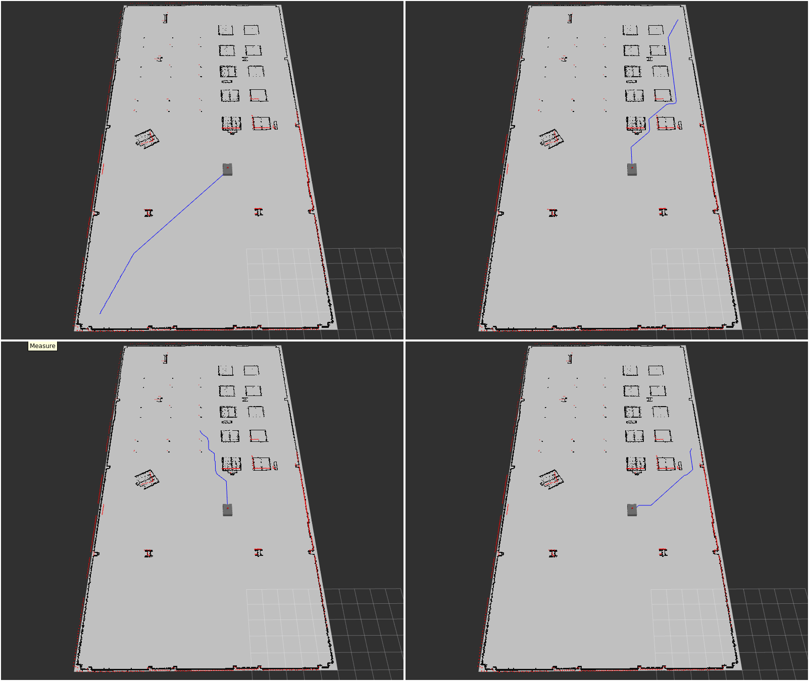

# Robot Navigation 

This repository is an end-to-end navigation pipeline for a differential-drive robot in simulation (Gazebo + RViz) using ROS 2.  
It connects the main building blocks of navigation in one place: mapping visualization, localization, global path planning, and path following—with both classic controllers and a reinforcement learning option.

## What’s inside

### 1) Map + Localization
- Loads a map file and publishes it on `/map` using nav2_map_server.
- Runs nav2_amcl to localize the robot on the map using 2D lidar (`/scan`).
<p align="center">
  <video src="https://github.com/user-attachments/assets/d258e9a6-9364-4408-aba3-6cb9773a2dce" width="90%" controls></video>
</p>

### 2) Path Planning
- Plans a collision-free path from the robot’s current pose to a goal pose.
- Publishes the planned path as nav_msgs/Path on `/planned_path`.



### 3) Path Following
You can follow the same planned path using one of these approaches:
- **RL controller (SAC)**: learns continuous velocity commands to follow the path. ([See the demo videos here](https://drive.google.com/file/d/1XU7ZZp4FTfud03Kc06ZOJ401wE49qK4v/view?usp=sharing))
- **Classic PID**: a simple baseline controller.
- **Classic MPC**: a sampling-based MPC that predicts a short horizon and picks the best (v,w).

<p align="center">
  <video src="https://github.com/user-attachments/assets/2f200236-cc99-4f06-8d8c-d1c6bfba35fc" width="90%" controls></video>
</p>

## Requirements
- Ubuntu 22.04
- ROS 2 Humble
- Gazebo GZ Fortress (LTS)
- Python dependency:
  - torch required for RL
- Install ROS dependencies with rosdep

## Setup
```bash
source /opt/ros/humble/setup.bash

git clone https://github.com/ta-tahmasebi/robot-navigation.git
cd robot-navigation

rosdep update
rosdep install --from-paths src --ignore-src -r -y
````

## Run

### Terminal 1 — Localization

```bash
source /opt/ros/humble/setup.bash
./localization.sh
```

### Terminal 2 — Simulation

```bash
source /opt/ros/humble/setup.bash
./gazebo.sh
```

### Terminal 3 — Plan path

```bash
source /opt/ros/humble/setup.bash

# If RViz pose and Gazebo pose do not match:
./center.sh

# Plan a path to a goal:
./a_star.sh <goal_x> <goal_y> [robot_radius_cells]
# Example:
./a_star.sh 19 8
```

### Terminal 4 — Choose ONE controller to follow the path

```bash
source /opt/ros/humble/setup.bash

# Choose only one:
./rl.sh
# or
./classic.sh pid
# or
./classic.sh mpc
```


* Run **only one** controller at a time to avoid multiple nodes publishing to `/cmd_vel`.
* If you only want the classic controllers, you can skip installing torch.
* If AMCL starts from a wrong pose, you can also set the pose in RViz using 2D Pose Estimate.


